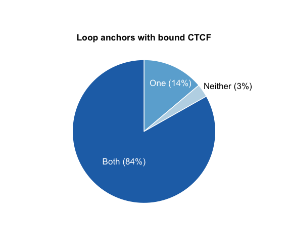

[](https://travis-ci.org/PhanstielLab/bedtoolsr)

## Overview

The [bedtools suite of programs](https://bedtools.readthedocs.io/) is a widely used set of various utilities for genomic analysis. This R package provides a convenient wrapper for bedtools functions allowing for the documentation and use of them from within the R environment. This includes manual pages for all functions as well as key added features including the ability to provide either file paths or R objects as inputs and outputs.

## Installation

bedtoolsr can be installed directly from GitHub using the following commands:

```
install.packages("devtools")
devtools::install_github("PhanstielLab/bedtoolsr")
```

Note that if `bedtools` is not found in R's PATH, or you want to use a specific version, you can manually specify the desired directory in R with:

```
options(bedtools.path = "[bedtools path]")
```

You can also install a specific [release](https://github.com/PhanstielLab/bedtoolsr/releases) for a particular version of bedtools. Download the corresponding zip file (*not* the source code), decompress, and install from R:

```
install.packages("/path/to/bedtools_v2.28.0-7", type="source", repos=NULL)
```

### Operating System Support

`bedtoolsr` should work on any system with R and bedtools installed. It has been tested on macOS (version 10.14 "Mojave") and Linux (Ubuntu version 18.04). bedtools is not available for Windows; however, you can either use a virtual machine or [Windows Subsystem for Linux](https://docs.microsoft.com/en-us/windows/wsl/install-win10). In either case, R from the Windows side would not be able to access bedtools running on the Linux side, so R and `bedtoolsr` would also have to be installed on the Linux side.

### Example Usage

```
A.bed <- data.frame(chrom=c("chr1", "chr1"), start=c(10, 30), end=c(20, 40))
B.bed <- data.frame(chrom=c("chr1"), start=15, end=20)

> bedtoolsr::bt.intersect(A.bed, B.bed)
    V1 V2 V3
1 chr1 15 20
```

### Complex Example

In this more complex example, loop calls in bedpe format are downloaded from [Phanstiel et. al, 2017](https://www.cell.com/molecular-cell/fulltext/S1097-2765(17)30603-2?_returnURL=https%3A%2F%2Flinkinghub.elsevier.com%2Fretrieve%2Fpii%2FS1097276517306032%3Fshowall%3Dtrue) and CTCF ChIP-seq peak calls are downloaded from [Van Bortle et. al, 2017.](https://genomebiology.biomedcentral.com/articles/10.1186/s13059-017-1310-3) `bedtoolsr` is used to add 5kb on either side of the CTCF peaks with the `bedtoolsr::slop` function before the `bedtoolsr::pairtobed` function computes overlap of CTCF peaks with either both, one, or neither loop anchor from the loop call bedpe file. The total and percentage of loops found in each case is calculated then plotted with `ggplot2`.

```
## Download and unzip loop calls bedpe file from Phanstiel et. al, 2017
download.file(url = "https://www.cell.com/cms/10.1016/j.molcel.2017.08.006/attachment/0a5229f1-46bb-4aae-aa42-33651377e633/mmc3.zip",
              destfile =  "Loops_PMA.txt.zip")
unzip(zipfile = "Loops_PMA.txt.zip", files = "molcel_6338_Table_S2_Loops_PMA.txt")


## Download CTCF Peak bed file from Van Bortle et. al, 2017
download.file(url = "https://www.ncbi.nlm.nih.gov/geo/download/?acc=GSE96800&format=file&file=GSE96800%5FCTCF%5Fpeak%5FedgeR%5Fraw%2Etxt%2Egz",
              destfile = "CTCF_peaks.txt.gz")


## Read in bed and bedpe files (optional but helfpul for subsequent R operations)
loopsBedpe  <- read.table(file = "molcel_6338_Table_S2_Loops_PMA.txt", header = T)
ctcfPeaks   <- read.table(file = gzfile("CTCF_peaks.txt.gz"), header = T)

## Add 5kb up/downstream from each ctcf peak with the bedtoolsr slop function
ctcfPeaks   <- bedtoolsr::slop(i = ctcfPeaks, g = "data/hg19", b = 5000, header = T)

## Compute overlaps with bedtoolsr (find loops that have CTCF bound at both, one, or no ends?)
bothEnds    <- bedtoolsr::pairtobed(a = loopsBedpe, b = ctcfPeaks, type = "both")
oneEnd      <- bedtoolsr::pairtobed(a = loopsBedpe, b = ctcfPeaks, type = "xor")
neitherEnd  <- bedtoolsr::pairtobed(a = loopsBedpe, b = ctcfPeaks, type = "neither")

## Count the number of loops found in each case
totalN      <- nrow(unique(loopsBedpe))
bothN       <- nrow(unique(bothEnds[,1:10]))
oneN        <- nrow(unique(oneEnd[,1:10]))
neitherN    <- nrow(unique(neitherEnd[,1:10]))

## Calculate percentages of the total number of loops and round
bothP       <- round(bothN/totalN*100)
oneP        <- round(oneN/totalN*100)
neitherP    <- round(neitherN/totalN*100)


## Create data frame to plot results
df  <- data.frame(
        group = c("Both", "One", "Neither"),
        number = c(bothN, oneN, neitherN),
        percent = c(bothP, oneP, neitherP)
    )

## Plot results
library(ggplot2)
ggplot(data = df, aes(x = 1, y = percent, fill = group))+
  geom_col(col = "white")+
  coord_polar("y") + 
  scale_fill_manual(values = c("#2171b5", "#bdd7e7", "#6baed6"))+
  labs(title = "Loop anchors with bound CTCF")+
  annotate(geom = "text",
           x = c(1.0, 1.25, 1.75),
           y = c(60, 8, 17.25),
           label = paste0(df$group, " (", df$percent, "%)"),
           col = c("white", "white", "black"),
           size = 4.5)+
  theme_void()+
  theme(
    plot.title = element_text(hjust = 0.5, vjust = -15, face = "bold"),
    legend.position = "none", text = element_text(face = "bold")
  )
```



## Building for a different version of bedtools

In order to more easily support past and future versions of bedtools we adopted a metaprogramming approach.  A single python script reads `bedtools --help` output and automatically generates the entire R package. It was designed to be generic so that it can be rebuilt quickly for any version of bedtools.

To generate a new version of `bedtoolsr`, run [makePackage.py](https://github.com/PhanstielLab/bedtoolsr/blob/master/dev/makePackage.py). There are command-line arguments for the location of bedtools, where the output package should go, and the package version suffix. Special cases are specified in [anomalies.json](https://github.com/PhanstielLab/bedtoolsr/blob/master/dev/anomalies.json).

## Testing

`bedtoolsr` uses continuous integration made possible by unit tests using the [testthat](https://github.com/r-lib/testthat) R package.  Once installed you can perform unit tests for most of the `bedtoolsr` functions using the following code:

First, install [testthat](https://github.com/r-lib/testthat) if not already installed:
```
install.packages('testthat')
````

Load `bedtoolsr` and `testthat`:
```
library('testthat')
library('bedtoolsr')
```

Perform tests:
```
testthat::test_package("bedtoolsr")
```

Expected results:
```
══ testthat results  ══════════════════════════════════════════════════════
OK: 24 SKIPPED: 0 FAILED: 0
```

## Contributions

We welcome user feedback and contributions on this package. If you have a question or a problem, the best approach is to report it is through [GitHub's issue tracker](https://github.com/PhanstielLab/bedtoolsr/issues). If you want to propose a change to the source code, either to fix a bug or make an improvement, use a [pull request](https://github.com/PhanstielLab/bedtoolsr/pulls).

## Website

For more information, please see the [bedtoolsr website](http://phanstiel-lab.med.unc.edu/bedtoolsr.html).

## Authors

* [Mayura Patwardhan](https://github.com/mayurapatwardhan)
* [Craig Wenger](https://github.com/cwenger)
* [Eric Davis](https://github.com/EricSDavis)
* [Doug Phanstiel](https://github.com/dphansti)

## Contact

douglas_phanstiel@med.unc.edu
